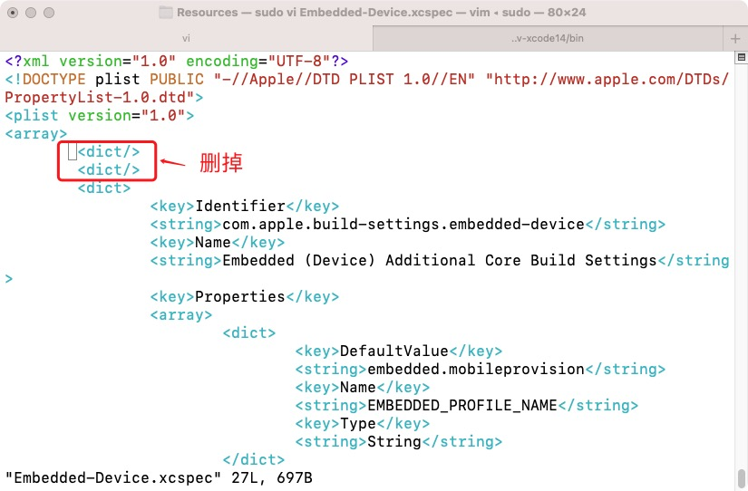
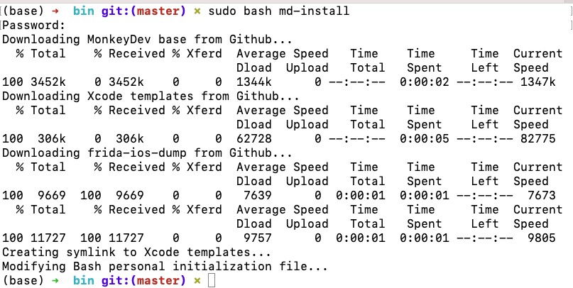
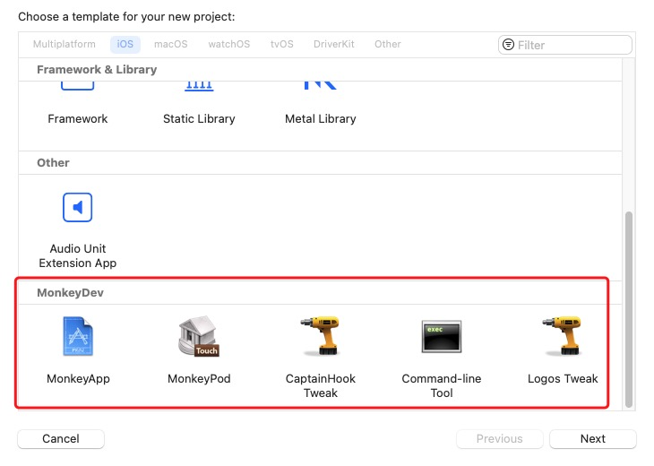

# MonkeyDev

兼容 Xcode 14.2


```shell
xcode-select: error: tool 'xcodebuild' requires Xcode, but active developer directory '/Library/Developer/CommandLineTools' is a command line tools instance

解决:
1. 打开应用程序文件夹 
2. 对 xcode 右键 显示包含内容
3. 命令行 打开 xcode 目录, pwd
4. 修复 xcode 选择目录
sudo xcode-select --switch /Applications/Xcode.app/Contents/Developer

# 校对 xcode 版本
xcodebuild -version


```

```shell
File /Applications/Xcode.app/Contents/PlugIns/IDEiOSSupportCore.ideplugin/Contents/Resources/Embedded-Device.xcspec not found
```

```shell
# xcode 14.2 路径正确 
File /Applications/Xcode.app/Contents/Developer/Platforms/MacOSX.platform/Developer/Library/Xcode/Specifications/MacOSX Package Types.xcspec not found
```


```shell
# 用的vscode 命令行 权限不足, 新开系统命令行运行 即可
sudo bash ./bin/md-install 
cp: /Applications/Xcode.app/Contents/PlugIns/XCBSpecifications.ideplugin/Contents/Resources/Embedded-Device.xcspec.MonkeyDev: Operation not permitted
Failed to copy file /Applications/Xcode.app/Contents/PlugIns/XCBSpecifications.ideplugin/Contents/Resources/Embedded-Device.xcspec to /Applications/Xcode.app/Contents/PlugIns/XCBSpecifications.ideplugin/Contents/Resources/Embedded-Device.xcspec.MonkeyDev
```


# 闪退
```shell
xcodebuild[9921:220102] [MT] DVTAssertions: ASSERTION FAILURE in /System/Volumes/Data/SWE/Apps/DT/BuildRoots/BuildRoot2/ActiveBuildRoot/Library/Caches/com.apple.xbs/Sources/IDEXcode3ProjectSupport/IDEXcode3ProjectSupport-21525/Xcode3Core/LegacyProjects/Frameworks/DevToolsCore/DevToolsCore/Foundation/Specifications/XCSpecification.m:721
Details:  Failed to register spec from /Applications/Xcode.app/Contents/PlugIns/XCBSpecifications.ideplugin: {
    SourceDescription = "/Applications/Xcode.app/Contents/PlugIns/XCBSpecifications.ideplugin";
}: Error Domain=XCSpecificationErrorDomain Code=0 "couldn't register specification: malformed property list dictionary (required key 'Identifier' not present)" UserInfo={NSLocalizedDescription=couldn't register specification: malformed property list dictionary (required key 'Identifier' not present)}
Object:   <XCSpecification>
Method:   +registerSpecificationsFromDVTPlugInsForDomains:skippingDomains:
Thread:   <_NSMainThread: 0x600003e10100>{number = 1, name = main}
Hints: 

Backtrace:
  0   -[DVTAssertionHandler handleFailureInMethod:object:fileName:lineNumber:assertionSignature:messageFormat:arguments:] (in DVTFoundation)
  1   _DVTAssertionHandler (in DVTFoundation)
  2   _DVTAssertionFailureHandler (in DVTFoundation)
  3   +[XCSpecification registerSpecificationsFromDVTPlugInsForDomains:skippingDomains:] (in DevToolsCore)
  4   XCInitializeCoreIfNeeded (in DevToolsCore)
  5   +[Xcode3CoreInitializer ide_initializeWithOptions:error:] (in Xcode3Core)
  6   _IDEInitializeBuildSystem (in IDEFoundation)
  7   IDEInitialize (in IDEFoundation)
  8   -[Xcode3CommandLineBuildTool run] (in Xcode3Core)
  9   XcodeBuildMain (in libxcodebuildLoader.dylib)
 10   start (in dyld)
```
```shell
# 编辑
sudo vi /Applications/Xcode.app/Contents/PlugIns/XCBSpecifications.ideplugin/Contents/Resources/Embedded-Device.xcspec
``` 


# 配置完成




# 参考
[MonkeyDev](https://github.com/AloneMonkey/MonkeyDev/wiki/%E5%AE%89%E8%A3%85)

[闪退修改文件](https://github.com/AloneMonkey/MonkeyDev/issues/297#issuecomment-919684775)